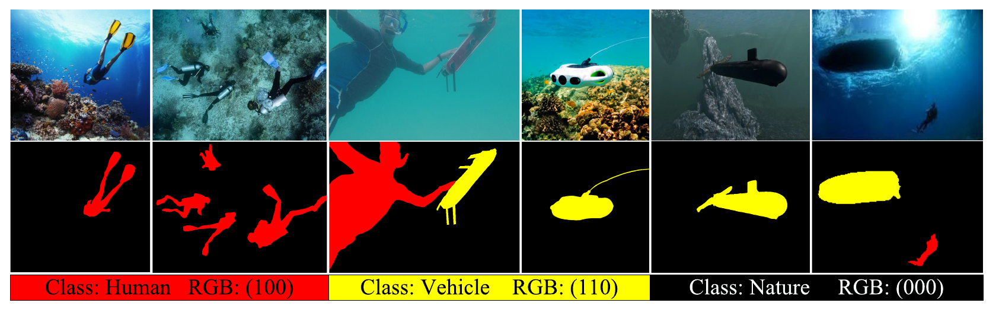
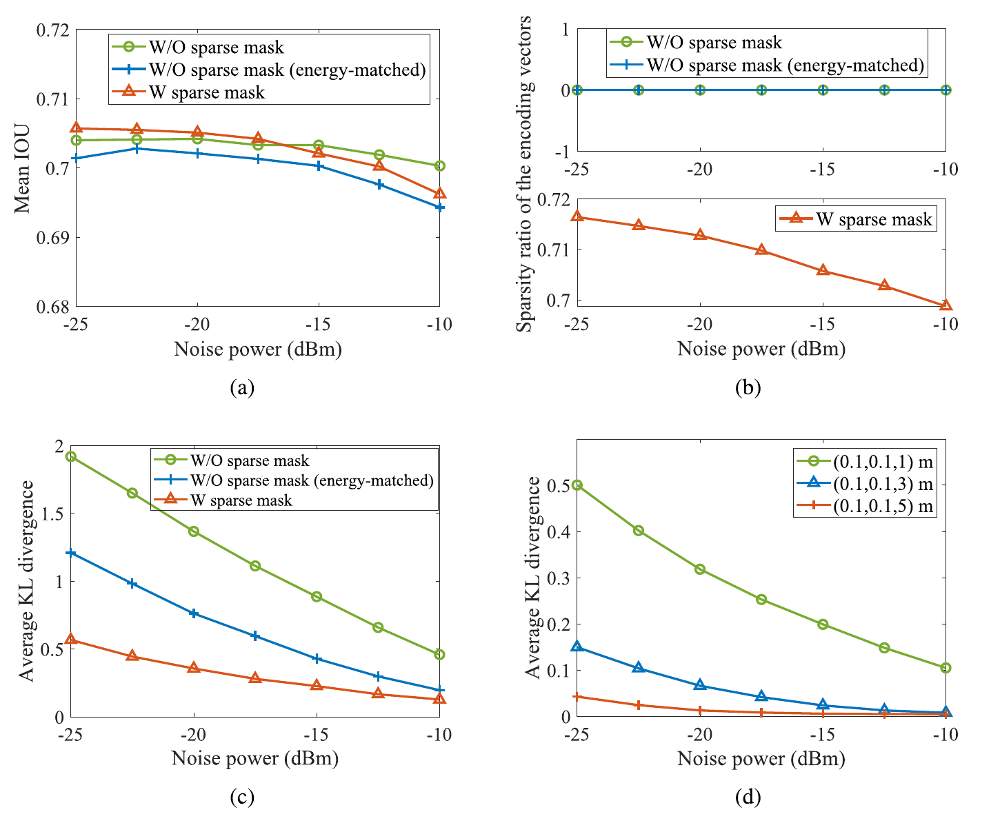

# Covertness-Oriented Water-to-Air Optical Wireless Semantic Communications

**Qingqing Hu, Bin Chen, Yi Lei, and Chen Gong**  
IEEE Transactions on Green Communications and Networking, vol. 10, pp. 4380–4391, 2026.

[Paper PDF](docs/paper.pdf) · [DOI](https://doi.org/10.1109/TGCN.2026.3734354) · [Data and weights](https://github.com/qingqinghu-Ricky/Covert-semantic-communication-for-W2A-OWC/releases/tag/v1.0.0)

This repository provides the code and **Underwater Anomaly Monitoring (UAM)**
dataset for covertness-oriented water-to-air optical wireless semantic
communications. The method learns a noise-adaptive sparse mask to retain
task-relevant semantic features, reducing transmitted symbols while maintaining
underwater anomaly segmentation accuracy. It includes the original pretrained
models, training initialization weights, and scripts for training and evaluating
**Fig. 7(a–d)**.

## UAM dataset

UAM contains **5,373 underwater RGB images** with pixel-level annotations for
three classes: **nature**, **human**, and **vehicle**. The dataset contains
**4,298 images for training and validation** and **1,075 test images**, covering
scenes with divers, swimmers, underwater vehicles, and natural backgrounds.

*Fig. 3 from the paper: example images and corresponding pixel annotations.
Red denotes human, yellow denotes vehicle, and black denotes nature.*

## Core results

*Fig. 7 from the paper: (a) Bob's mean IoU, (b) encoding-vector sparsity ratio,
(c) average KL divergence at Willie at (0, 0, 1) m, and (d) average KL divergence
at different Willie positions, versus noise power.*

The paper reports a mean IoU of **0.7057–0.6962** for the sparse-mask scheme as
noise power increases from **−25 to −10 dBm**. At **−20 dBm**, the reported KL
divergences under the same total transmit energy are:

| Scheme | KL divergence ↓ |
|---|---:|
| Sparse | 0.3569 |
| Energy-matched dense | 0.7621 |

The sparse mask preserves task-relevant semantic information while improving
covertness relative to the energy-matched dense baseline.

## Installation

Use Python 3.11, PyTorch 2.9.0 and torchvision 0.24.0. For CUDA 12.8:

~~~bash
python -m venv .venv
source .venv/bin/activate
pip install torch==2.9.0 torchvision==0.24.0 --index-url https://download.pytorch.org/whl/cu128
pip install -r requirements.txt
~~~

GPU evaluation is recommended. For CPU evaluation, install the matching CPU
PyTorch/torchvision wheels and pass `--device cpu` to the evaluator.

## Data and weights

Download the following assets from [Release v1.0.0](https://github.com/qingqinghu-Ricky/Covert-semantic-communication-for-W2A-OWC/releases/tag/v1.0.0):

| Asset | Contents |
|---|---|
| [uam_dataset.tar.gz](https://github.com/qingqinghu-Ricky/Covert-semantic-communication-for-W2A-OWC/releases/download/v1.0.0/uam_dataset.tar.gz) | 4,298 training/validation images and 1,075 test images with class-index PNG masks |
| [fig7_checkpoints.tar.gz](https://github.com/qingqinghu-Ricky/Covert-semantic-communication-for-W2A-OWC/releases/download/v1.0.0/fig7_checkpoints.tar.gz) | Original sparse/dense EMA models, frozen segmenter initialization, and ResNet18 initialization |

Extract the archives at the repository root:

~~~bash
tar --skip-old-files -xzf uam_dataset.tar.gz
tar --skip-old-files -xzf fig7_checkpoints.tar.gz
~~~

See the [dataset description](data/UAM/README.md) for the directory layout and
class indices. All necessary initialization weights are included.

## Reproduce Fig. 7

~~~bash
python scripts/evaluate_fig7.py
python scripts/plot_fig7.py
~~~

The evaluator covers the sparse, dense and energy-matched dense schemes at
seven noise powers from −25 to −10 dBm, including three additional Willie
positions. Outputs are saved under `results/fig7/`.
[Reference evaluation outputs](reference_results/) use the original checkpoints.

## Retrain from initialization

~~~bash
python scripts/reproduce_from_initialization.py
~~~

## License and citation

Code: MIT; author-created annotations: CC BY 4.0.
Original images retain their respective source terms; see
[dataset terms](DATA_LICENSE.md) and [third-party notices](NOTICE.md).

If you use the code or UAM dataset, please cite:

~~~bibtex
@article{hu2026covert,
  author  = {Qingqing Hu and Bin Chen and Yi Lei and Chen Gong},
  title   = {Covertness-Oriented Water-to-Air Optical Wireless Semantic Communications},
  journal = {IEEE Transactions on Green Communications and Networking},
  year    = {2026},
  volume  = {10},
  pages   = {4380--4391},
  doi     = {10.1109/TGCN.2026.3734354}
}
~~~
